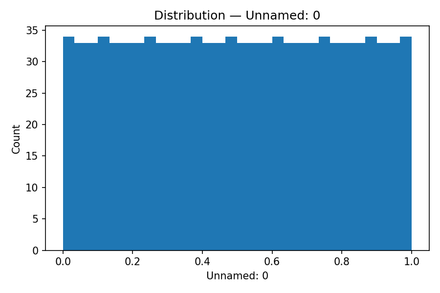
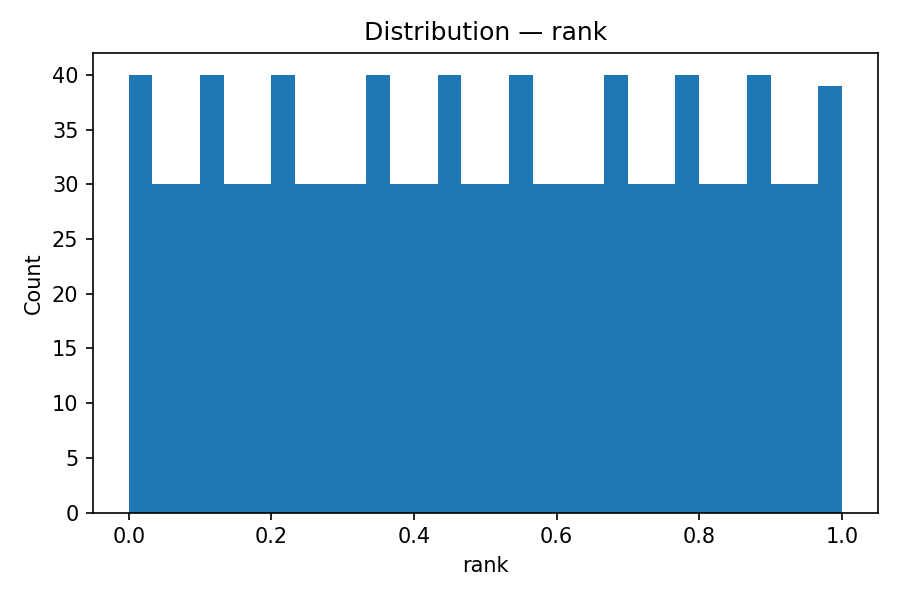
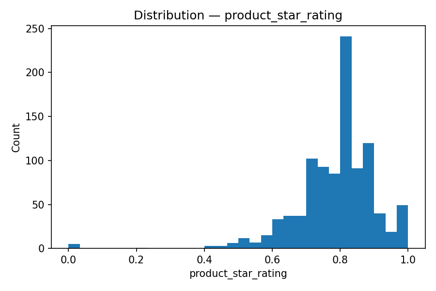
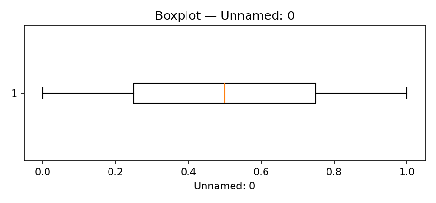
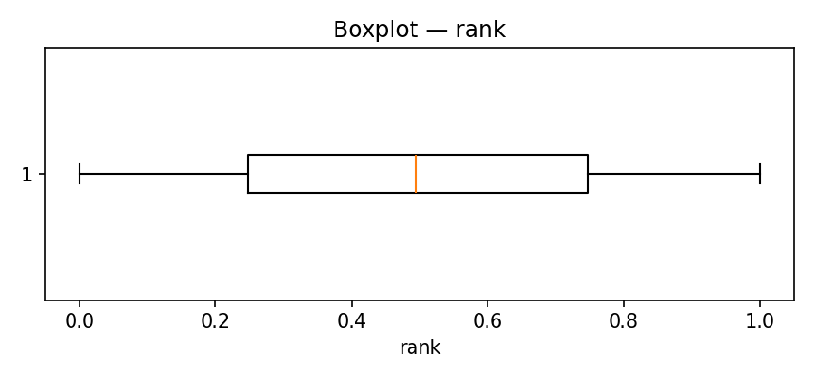
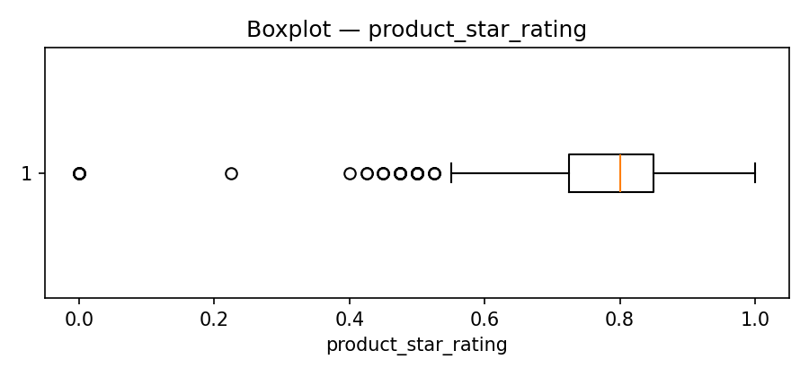
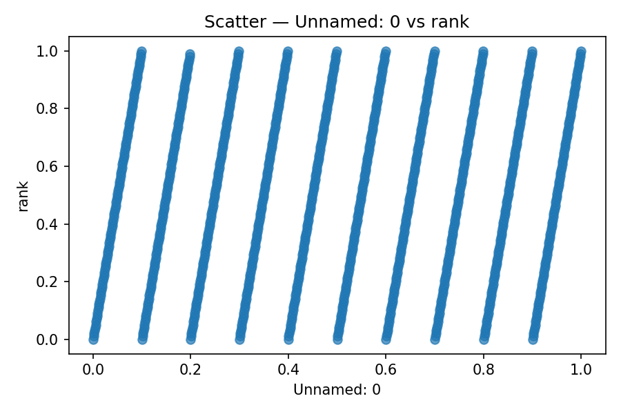
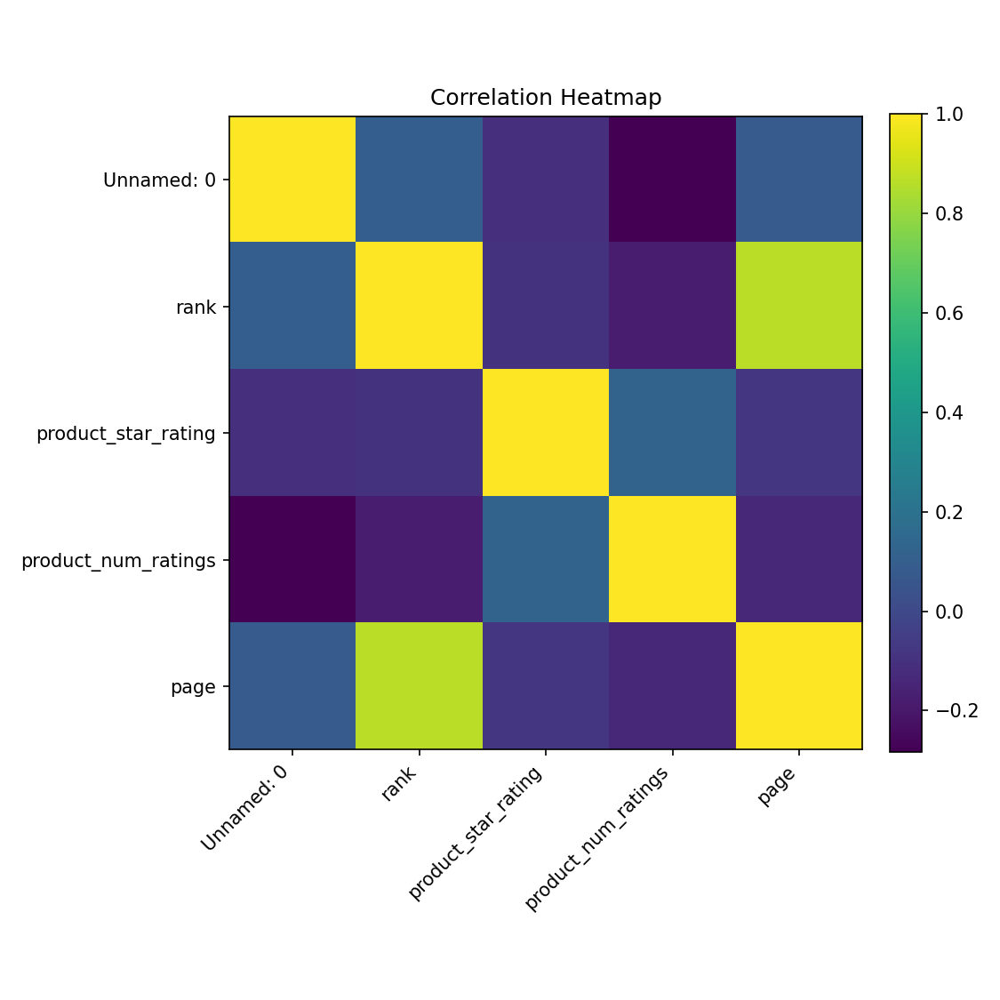

# Exploratory Data Analysis (Stage 08)


_Generated: 2025-08-26 10:32_


**Dataset:** `C:\Users\sarda\Desktop\bootcamp_darshit_sarda\homework\data\processed\amazon_bestsellers_2025_cleaned.csv`  


**Rows × Cols:** 999 × 11


## 1) Statistical Summaries

### `df.info()`

```text
<class 'pandas.core.frame.DataFrame'>
RangeIndex: 999 entries, 0 to 998
Data columns (total 11 columns):
 #   Column               Non-Null Count  Dtype  
---  ------               --------------  -----  
 0   Unnamed: 0           999 non-null    float64
 1   rank                 999 non-null    float64
 2   asin                 999 non-null    object 
 3   product_title        999 non-null    object 
 4   product_price        945 non-null    object 
 5   product_star_rating  999 non-null    float64
 6   product_num_ratings  999 non-null    float64
 7   product_url          999 non-null    object 
 8   product_photo        999 non-null    object 
 9   country              999 non-null    object 
 10  page                 999 non-null    float64
dtypes: float64(5), object(6)
memory usage: 86.0+ KB
```

### `df.describe()` (numeric)

|                     |   count |      mean |      std |   min |        25% |       50% |       75% |   max |
|:--------------------|--------:|----------:|---------:|------:|-----------:|----------:|----------:|------:|
| Unnamed: 0          |     999 | 0.5       | 0.289109 |     0 | 0.25       | 0.5       | 0.75      |     1 |
| rank                |     999 | 0.499499  | 0.291439 |     0 | 0.247475   | 0.494949  | 0.747475  |     1 |
| product_star_rating |     999 | 0.785511  | 0.122243 |     0 | 0.725      | 0.8       | 0.85      |     1 |
| product_num_ratings |     999 | 0.0666394 | 0.155581 |     0 | 0.00297061 | 0.0113092 | 0.0509172 |     1 |
| page                |     999 | 0.499499  | 0.50025  |     0 | 0          | 0         | 1         |     1 |

### Missing value counts

|                     |   missing |
|:--------------------|----------:|
| product_price       |        54 |
| Unnamed: 0          |         0 |
| rank                |         0 |
| asin                |         0 |
| product_title       |         0 |
| product_star_rating |         0 |
| product_num_ratings |         0 |
| product_url         |         0 |
| product_photo       |         0 |
| country             |         0 |
| page                |         0 |

### Column types

- Numeric columns (5): Unnamed: 0, rank, product_star_rating, product_num_ratings, page

- Categorical columns (6): asin, product_title, product_price, product_url, product_photo, country

- Date column: —

## 2) Distributions (Histograms & Boxplots)













## 3) Bivariate Visuals

**Scatter plot:**



_No date column or suitable numeric series for time plot._

## 4) Correlation Heatmap (Optional)



## 5) Findings: Skew, Outliers, Seasonality, Structure

- **Skewness:**
- **product_num_ratings** | |skew| = 3.83
- **product_star_rating** | |skew| = 1.69
- **page** | |skew| = 0.00

- **Strongest correlations (abs):**
- **page ~ rank**: |r| = 0.87
- **product_num_ratings ~ Unnamed: 0**: |r| = 0.28
- **product_num_ratings ~ rank**: |r| = 0.18

- **Missing values (top):**
- **product_price**: 54 missing

## 6) Implications for Next Step

- - Apply transformations to high-skew features (e.g., log/Box-Cox) before modeling.

- - Address multicollinearity (remove or combine highly correlated features) to stabilize models.

- - Impute or drop columns with substantial missingness; document rationale.

## Top 3 Insights

1. **Skewness:**
- **product_num_ratings** | |skew| = 3.83
- **product_star_rating** | |skew| = 1.69
- **page** | |skew| = 0.00

2. **Strongest correlations (abs):**
- **page ~ rank**: |r| = 0.87
- **product_num_ratings ~ Unnamed: 0**: |r| = 0.28
- **product_num_ratings ~ rank**: |r| = 0.18

3. **Missing values (top):**
- **product_price**: 54 missing

## Assumptions & Risks

- Missingness is assumed to be at random; if not, imputation may bias results.
- High correlations can inflate variance of coefficients; monitor VIF or use regularization.
- If outliers are business-meaningful events, trimming/winsorizing could harm signal.
- Correlation ≠ causation; domain validation is required before feature removal.